# WAZUH-SIEM-DETECTION-AND-RESPONSE-LAB

In this lab, I deployed Wazuh SIEM inside a Docker container on an Ubuntu Server, connected Windows and Kali Linux endpoints, configured File Integrity Monitoring (FIM), integrated VirusTotal for threat detection, and implemented active response to automatically remove malicious files from monitored systems.

## Objectives

- Deploy Wazuh SIEM using Docker
- Configure endpoint monitoring for Windows and Linux systems
- Implement File Integrity Monitoring (FIM)
- Integrate VirusTotal with Wazuh
- Configure active response for automatic threat removal
- Detect and respond to malicious files

## Lab Environment

In this lab, I used:

- Ubuntu Server CLI
- Microsoft Windows virtual machine
- Kali Linux virtual machine
- Docker
- Wazuh SIEM
- VMware Workstation
- VirusTotal API

## Wazuh Deployment

### Ubuntu Server Configuration

I started by deploying an Ubuntu CLI server and configured a static IP address, subnet mask, and default gateway. After configuring the required network settings, I rebooted the server.

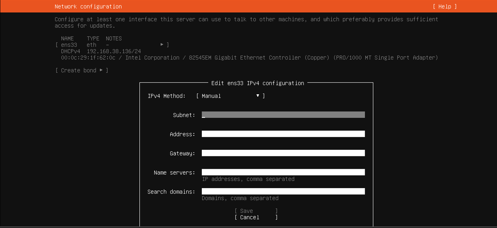

*Figure 1.1: Configuring the Ubuntu Server with a static IP address, subnet mask, and gateway.*

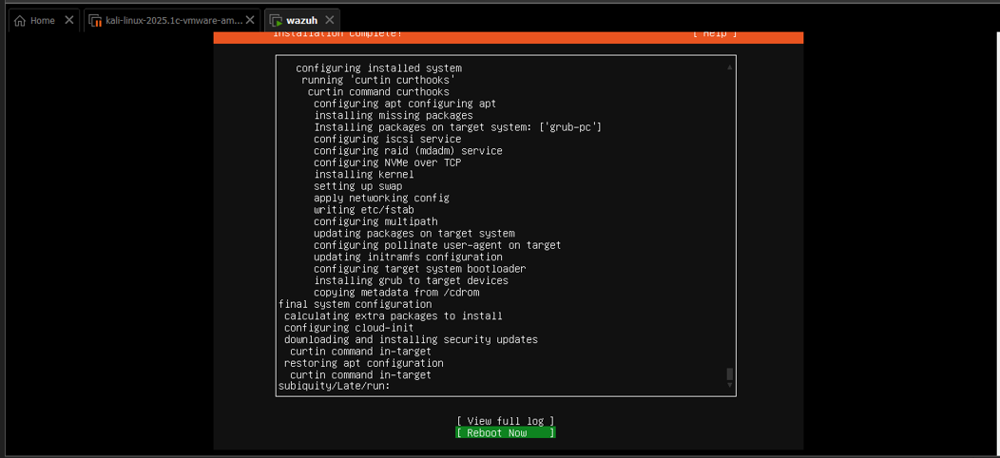

*Figure 1.2: Rebooting the Ubuntu Server after network configuration.*

### Wazuh Installation Using Docker

Using the Wazuh documentation, I installed Wazuh inside a Docker container on the Ubuntu Server.

I started Docker, assigned the required execution permissions, verified the Docker version, and then downloaded and installed the Wazuh Docker deployment package from GitHub using the commands provided in the Wazuh documentation.

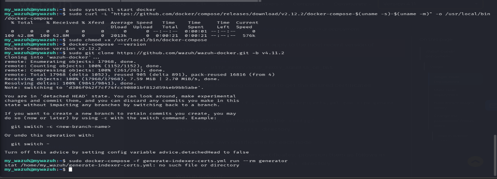

*Figure 2.1: Installing Wazuh using Docker on the Ubuntu Server.*

### Accessing the Wazuh Dashboard

After the installation was completed successfully, I accessed the Wazuh web interface by entering the server IP address into a web browser.

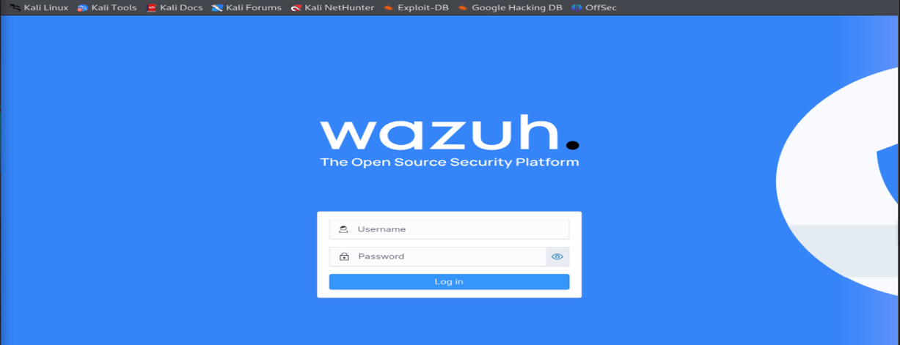

*Figure 2.2: Wazuh login page.*

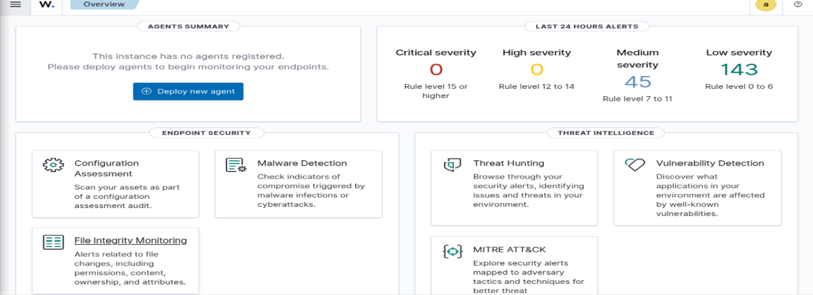

*Figure 2.3: Wazuh dashboard after successful deployment.*

## Agent Deployment and Management

### Deploying the Windows Agent

I navigated to the Agent Management section of the Wazuh dashboard and generated a new Windows agent package.

The agent was downloaded and installed on the Windows virtual machine and then enabled.

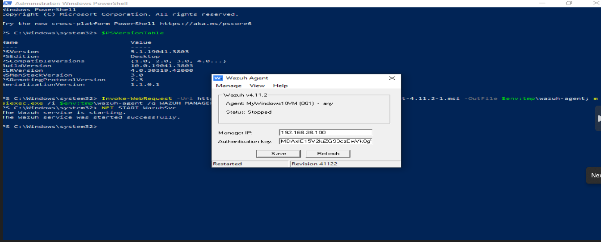

*Figure 3.1: Enabling the Wazuh agent on the Windows endpoint.*

### Deploying the Kali Linux Agent

I repeated the same process for the Kali Linux virtual machine and enabled the agent from the command line interface.

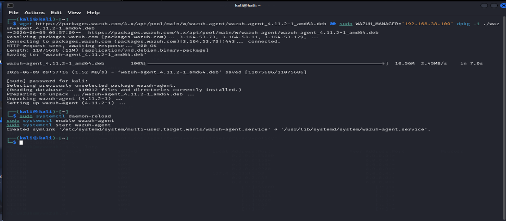

*Figure 3.2: Enabling the Wazuh agent on the Kali Linux endpoint.*

### Verifying Connected Agents

After both agents were configured, I confirmed that they were successfully connected from the Wazuh dashboard.

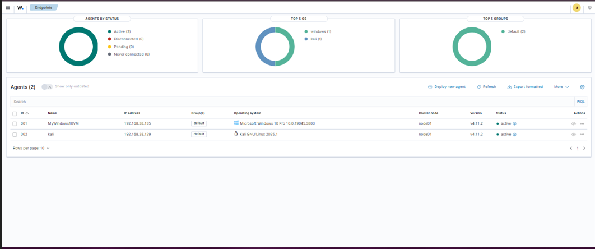

*Figure 3.3: Wazuh dashboard showing connected agents.*

## File Integrity Monitoring (FIM)

### Configuring File Integrity Monitoring on Kali Linux

To perform File Integrity Monitoring, I edited the ossec.conf file and added the directories I wanted Wazuh to monitor.

For the Kali Linux endpoint, I configured the required directories and ensured that the monitored path could be monitored in near real-time.

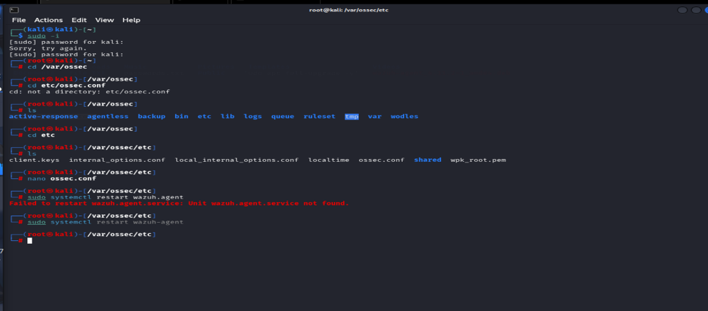

*Figure 4.1: Navigating to the OSSEC configuration file.*

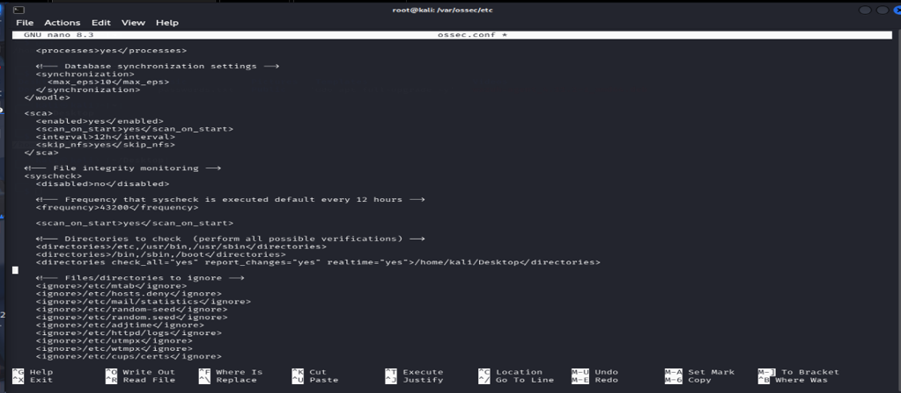

*Figure 4.2: Configuring File Integrity Monitoring on Kali Linux.*

### Configuring File Integrity Monitoring on Windows

I also added monitored directories to the ossec.conf file on the Windows endpoint.

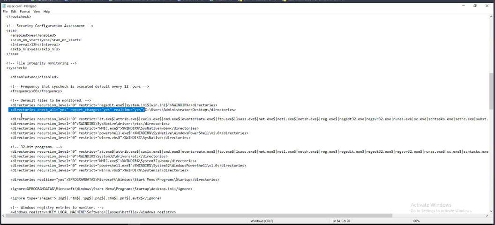

*Figure 4.3: Configuring File Integrity Monitoring on Windows.*

### Monitoring File Changes Through Wazuh

After modifying the configuration files, I restarted the agents and monitored file activity from the Wazuh dashboard.

The dashboard displayed detailed information including:

- Time of modification
- Type of modification
- Hash value changes
- User responsible for the modification
- File paths

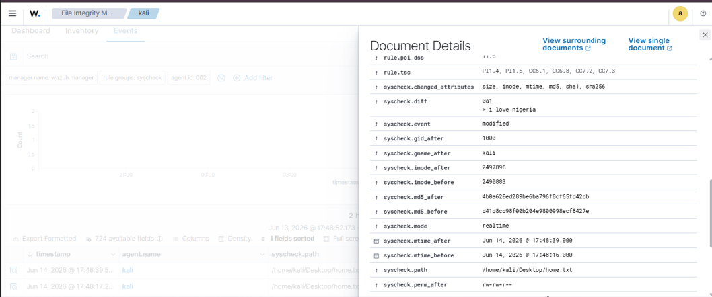

*Figure 4.4: File Integrity Monitoring events detected on Kali Linux.*

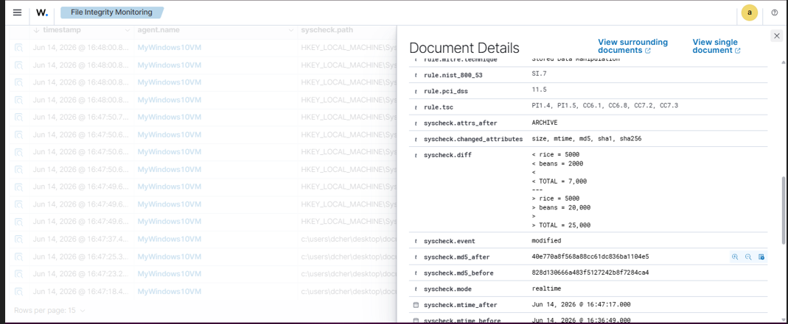

*Figure 4.5: Detailed information about monitored file changes.*

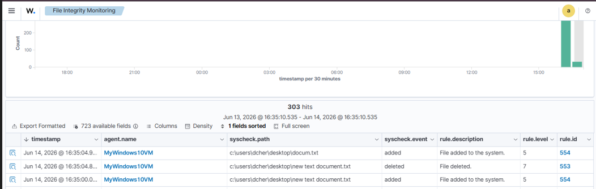

*Figure 4.6: Additional File Integrity Monitoring logs generated by Wazuh.*

## VirusTotal Integration and Active Response

### Configuring VirusTotal Integration

To detect malicious files, I integrated VirusTotal into Wazuh using an API key.

The API key was added to the Wazuh manager configuration so that detected files could be submitted to VirusTotal for reputation analysis.

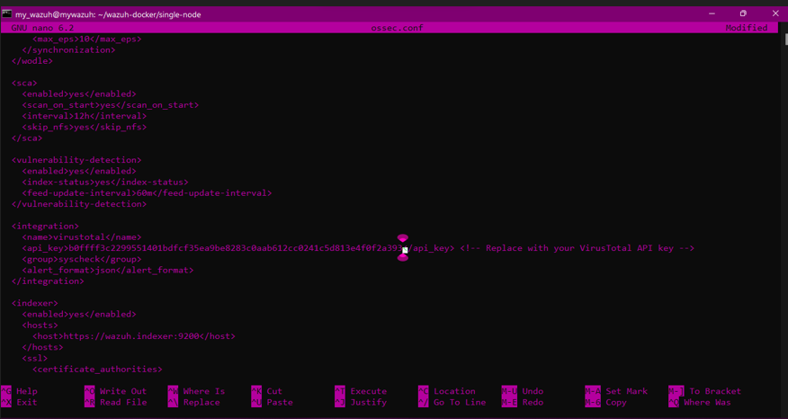

*Figure 5.1: Integrating the VirusTotal API key into Wazuh.*

### Preparing the Active Response Script on Kali Linux

For the Kali endpoint, I installed jq to process JSON input received by the active response script.

I then modified the permissions of the remove-threat script to make it executable and restarted the Wazuh agent.

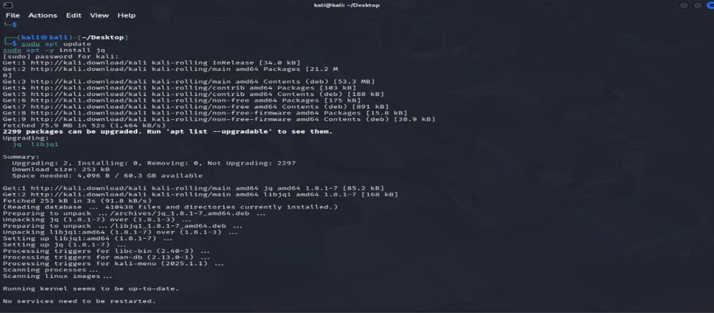

*Figure 5.1: Installing jq for JSON processing.*

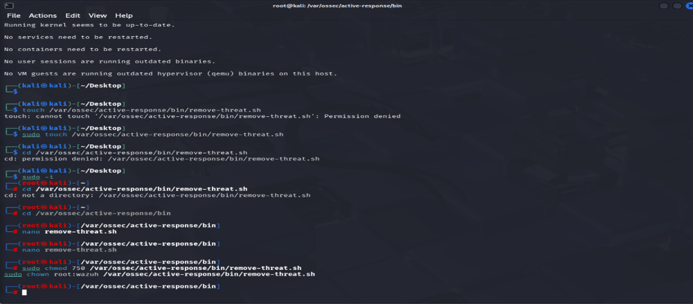

*Figure 5.2: Assigning executable permissions to the active response script.*

### Preparing the Active Response Script on Windows

On the Windows endpoint, I copied the Python code from the Wazuh documentation and saved it using Python IDLE.

Using PowerShell as Administrator, I converted the script into an executable file using:

```powershell
pyinstaller -F remove-threat.py
```

The generated executable was then moved into the required Wazuh directory.

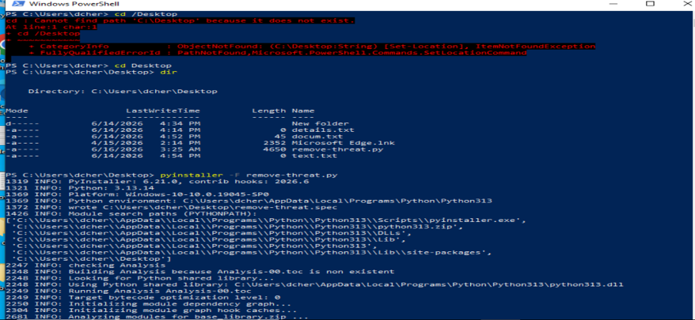

*Figure 5.3: Converting the Windows active response script into an executable.*

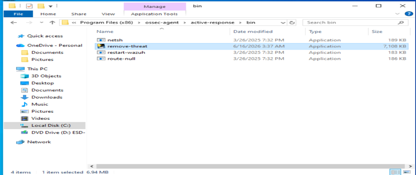

*Figure 5.4: Moving the executable into the required directory.*

### Editing Wazuh Configuration Files

While working inside the Docker container, I discovered that the nano editor was unavailable.

To resolve this issue, I modified the docker-compose.yml file and mapped the Ubuntu Server nano executable into the Docker container.

After restarting the container, I was able to edit the Wazuh configuration files and continue the VirusTotal integration process.

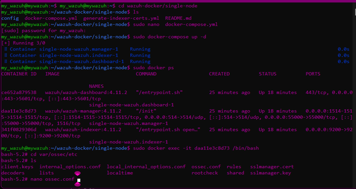

*Figure 5.5: Accessing the Wazuh manager configuration files.*

### Creating Custom Detection Rules

I created custom rules within local_rules.xml to generate alerts whenever changes were detected by File Integrity Monitoring.

After adding the rules, I restarted both the Wazuh manager and Docker services.

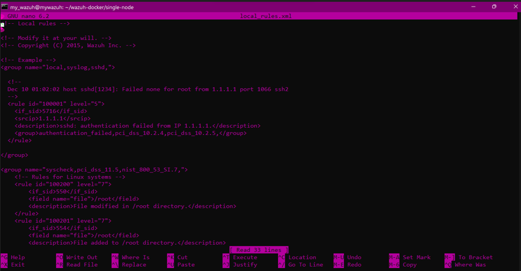

*Figure 5.7: Creating custom rules for File Integrity Monitoring events.*

## Threat Detection and Automatic Removal

### Testing Detection Using EICAR

To validate the integration and active response functionality, I downloaded an EICAR test file onto both monitored endpoints.

### Threat Detection on Windows

When the EICAR file was downloaded on the Windows endpoint, Wazuh detected the file and submitted it to VirusTotal for analysis

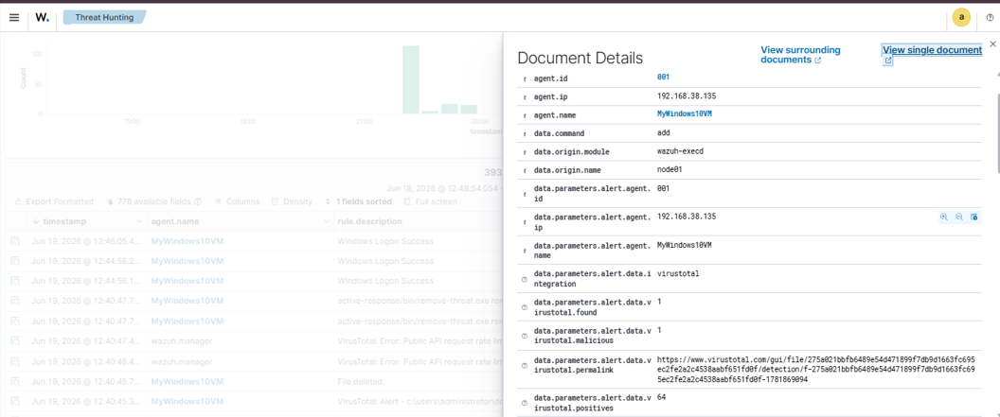

*Figure 6.1: VirusTotal detection and active response on the Windows endpoint.*

### Threat Detection on Kali Linux

The same test was performed on the Kali Linux endpoint, where the EICAR file was detected and processed by Wazuh.

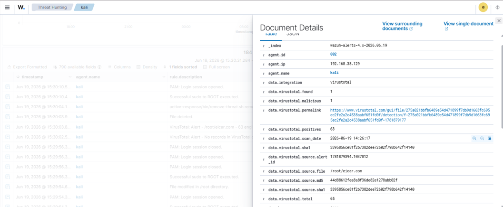

*Figure 6.2: VirusTotal detection on the Kali Linux endpoint.*

### Automatic Threat Removal Validation

After detection, the active response mechanism automatically removed the malicious file from both monitored systems.

When I checked the monitored directories, the EICAR files were no longer present.

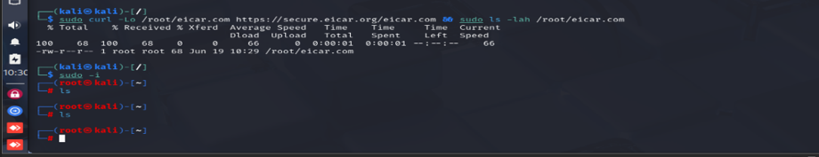

*Figure 6.3: Automatic removal of the malicious file on Kali Linux.*

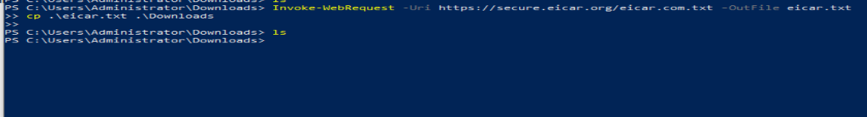

*Figure 6.4: Automatic removal of the malicious file on Windows.*

## Findings and Challenges

### Findings

- Wazuh was successfully deployed using Docker.
- Windows and Kali Linux agents were successfully onboarded.
- File Integrity Monitoring was successfully configured on both endpoints.
- VirusTotal integration was successfully implemented.
- Active response successfully removed malicious files.
- EICAR test files were detected and removed automatically.

### Challenges

- The nano editor was unavailable inside the Docker container.
- Additional Docker configuration was required to make nano accessible within the container.
- VirusTotal integration required multiple configuration changes across endpoints and the Wazuh manager.

---

## Skills Demonstrated

Through this lab, I demonstrated the following technical skills:

- SIEM Deployment and Administration

- Wazuh Configuration and Management

- Endpoint Security Monitoring

- File Integrity Monitoring (FIM)

- Threat Detection and Investigation

- Active Response Automation

- VirusTotal Integration

- Windows and Linux Security Monitoring

- Docker Deployment and Management

- Security Incident Response

